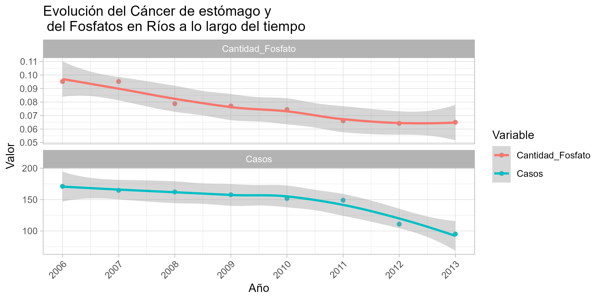

# FOSFATO EN RÍOS, CÁNCER DE ESTÓMAGO Y ECONOMÍA

#### Carmen Albillos Gubia

#### María Acevedo Fernández.

### INTRODUCCIÓN

Repositorio creado y desarrollado por alumnas del grupo 102 de la asignatura "Fuentes de Datos Biomédicas y Web Semántica", del grado Ingeniería de la Salud, Universidad de Burgos.

En este proyecto se estudia la posible relación entre el ***cáncer de estómago*** y la cantidad de ***fosfatos en ríos***. Además de cómo se ven influenciados por la ***economía*** de cada país Europeo. Para ello se ha recogido información sobre:

-   Los mg de PO04 por litro en los ríos de Europa (año 1992 - año 2021)

-   El número de casos de cáncer de estómago en Europa (año 2006 - año 2013)

-   El PIB de cada país de Europa (año 2012 - año 2020)

### OBJETIVOS Y PREGUNTAS

1.  Evolución del fosfato en ríos a lo largo de los años.
2.  Cantidad de fosfato en los distintos ríos de los paises europeos.
3.  Relación del PIB de Europa con la cantidad de fosfato en ríos.
4.  Influencia del sexo de los pacientes con el cáncer de estómago.
5.  Evolución de las tasas de cáncer de estómago a lo largo del tiempo.
6.  Relación del cáncer de estómago con la cantidad de fosfatos en ríos.

### CONCLUSIÓN FINAL

Tras el análisis de datos y la realización de gráficas se ha concluido que, tanto la concentración de fosfatos en los ríos, como las tasas de cáncer de estómago en Europa, han disminuido con el tiempo.

Estos datos sugieren la posibilidad de una relación entre ambos fenómenos. En este sentido, los fosfatos presentes en detergentes, fertilizantes y productos del sector industrial pueden terminar contaminando los ríos. Posteriormente, esta agua contaminada podría ser utilizada para riego en la agricultura, afectando a la cadena alimentaria y, en consecuencia, a la salud humana, particularmente en forma de problemas digestivos.

En conclusión, el desarrollo de cáncer de estómago podría estar relacionado con la concentración de fosfatos en los ríos. Sin embargo, es importante destacar que el periodo de tiempo analizado (2006-2013) es relativamente limitado y no abarca años más recientes. Contar con datos más amplios y actualizados permitiría obtener conclusiones más precisas, especialmente considerando que en los últimos años se han implementado medidas más estrictas de protección ambiental, así como avances en técnicas y tratamientos para la prevención del cáncer.

### REFERENCIAS

1.  Unión Europea. (2012). Reglamento (UE) nº 259/2012 del Parlamento Europeo y del Consejo, de 14 de marzo de 2012, por el que se modifica el Reglamento (CE) nº 648/2004 en lo que se refiere al uso de fosfatos y otros compuestos de fósforo en detergentes para lavavajillas automáticos y para ropa destinados a los consumidores. Boletín Oficial del Estado. <https://www.boe.es/buscar/doc.php?id=DOUE-L-2012-80470>

2.  Unión Europea. (n.d.). Good quality water in Europe: EU water directive. EUR-Lex. <https://eur-lex.europa.eu/ES/legal-content/summary/good-quality-water-in-europe-eu-water-directive.html>

3.  Estadísticas clave del cáncer de estómago (gástrico). (s/f). Cancer.org. Recuperado el 1 de diciembre de 2024, de <https://www.cancer.org/es/cancer/tipos/cancer-de-estomago/acerca/estadisticas-clave.html>

4.  Redirect notice. (s/f). Google.com. Recuperado el 1 de diciembre de 2024, de <https://www.google.com/url?sa=i&url=https%3A%2F%2Fwww.revistarevisionesencancer.com%2FfilesPortalWeb%2F53%2FMA-H0049-01.pdf%3FMy09cjCxIWAxuGhJPieEtF8zM6L1LW9d&psig=AOvVaw0A9RemcMz3tmpiqZCHm0Tk&ust=1733170836059000&source=images&cd=vfe&opi=89978449&ved=0CAYQrpoMahcKEwiQ78TRsoeKAxUAAAAAHQAAAAAQBA>

5.  OpenAI. (2024). ChatGPT (versión 4). Se ha empleado el uso de esta inteligencia artificial para importar los datos de cancer de estómago, para conseguir generar de forma correcta el grafico_pib_fosfato y el grafico_menor_fosfato. En algunos casos, también se ha utilizado para que en el eje x de los gráficos aparezcan todos los datos y para que estas etiquetas se giren y así facilitar su visualización.
