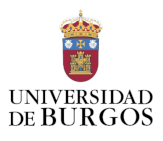

# FOSFATO EN RÍOS, CÁNCER DE ESTÓMAGO Y ECONOMÍA

{align="right" height="120"}

#### Carmen Albillos Gubia

#### María Acevedo Fernández.

### INTRODUCCIÓN

Repositorio creado y desarrollado por alumnas del grupo 102 de la asignatura "Fuentes de Datos Biomédicas y Web Semántica", del grado Ingeniería de la Salud, Universidad de Burgos.

En este proyecto se estudia la posible relación entre el ***cáncer de estómago*** y la cantidad de ***fosfatos en ríos***. Además de cómo se ven influenciados por la ***economía*** de cada país Europeo. Para ello se ha recogido información sobre:

-   Los mg de PO04 por litro en los ríos de Europa (año 1992 - año 2021)

-   El número de casos de cáncer de estómago en Europa (año 2006 - año 2013)

-   El PIB de cada país de Europa (año 2012 - año 2020)

### OBJETIVOS Y PREGUNTAS

1.  Evolución del fosfato en ríos a lo largo de los años.
2.  Cantidad de fosfato en los distintos ríos de los paises europeos.
3.  Relación del PIB de Europa con la cantidad de fosfato en ríos.
4.  Influencia del sexo de los pacientes con el cáncer de estómago.
5.  Evolución del cáncer de estómago a lo largo del tiempo.
6.  Relación del cáncer de estómago con la cantidad de fosfatos en ríos.

### CONCLUSIÓN FINAL

### REFERENCIAS
