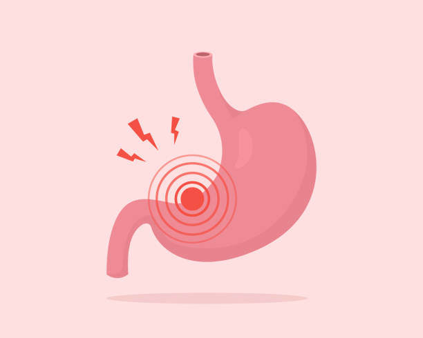
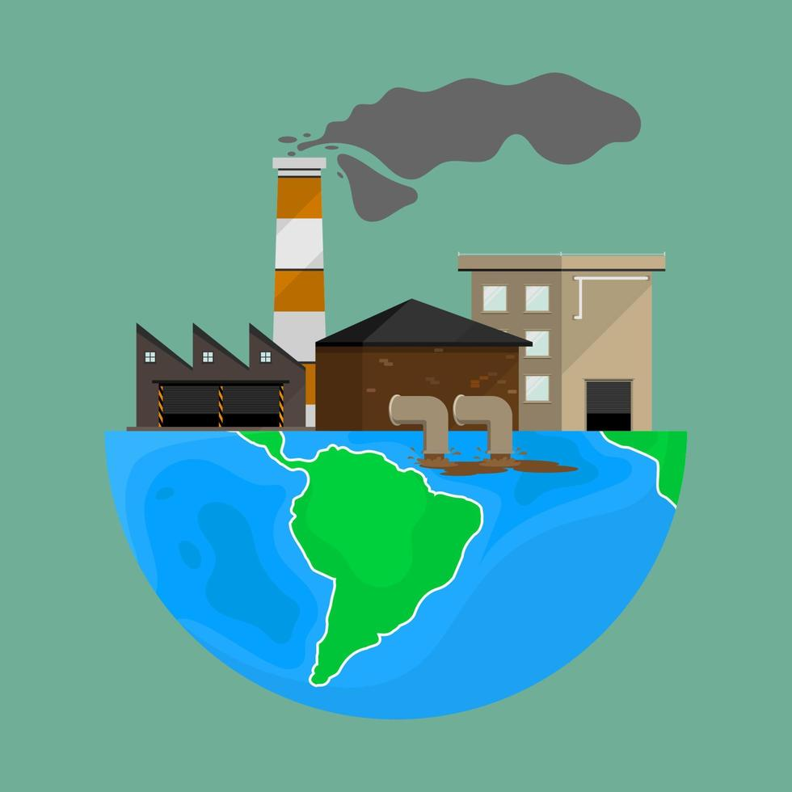

```{r setup, include=FALSE}
knitr::opts_chunk$set(echo = TRUE)
```

Repositorio GitHub: <https://github.com/maf1013/Practica5.git>

## 1. INTRODUCCIÓN

En este proyecto se estudia la posible relación entre el ***cáncer de estómago*** y la cantidad de ***fosfatos en ríos***. Además de cómo se ven influenciados por la ***economía*** de cada país Europeo. Para ello se ha recogido información sobre:

-   Los mg de PO04 por litro en los ríos de Europa (año 1992 - año 2021)

-   El número de casos de cáncer de estómago en Europa (año 2006 - año 2013)

-   El PIB de cada país de Europa (año 2012 - año 2020)


<div style="display: flex; justify-content: space-between;">
  
  
</div>

## 2. OBJETIVO GENERAL

Con este estudio, se pretende determinar si la contaminación de los ríos causada por la presencia de fosfatos en sus aguas afecta a la salud humana, específicamente en el desarrollo de cáncer de estómago. Además, se analizará si estas tasas están relacionadas con el desarrollo económico de cada país, evaluando el PIB (Producto Interior Bruto) como posible factor influyente.

## 3. OBJETIVOS ESPECÍFICOS

### CARGA DE PAQUETES: 

```{r,message=FALSE, warning=FALSE}
library(readr)
library(dplyr)
library(tidyverse)
library(ggplot2)
```


### CARGA DE DATOS:
Fosfatos en ríos en Europa desde el año 2000 hasta el 2021
```{r, message=FALSE, warning=FALSE, include=TRUE}
Fosfato <- read_csv("INPUT/DATA/fosfato.csv") %>%
  select(-`Period:text`) %>%  #Se eliminina una columna que estaba llena de texto innecesario                           
  rename(País = `Country:text`,                           
         Año = `Year:year`,         #Se renombran las columnas               
         Cantidad_Fosfato = colnames(.)[3]) %>%   #El nombre de la tercera columna mg P/I:number se sustituye por Cantidad_Fosfato   
  arrange(País, Año)%>%   # Ordena la tabla por orden alfabético de País
  group_by(País, Año)%>%
  summarise(Cantidad_Fosfato = mean(Cantidad_Fosfato, na.rm = TRUE), .groups = "drop")
  #En algunos países habia dos datos distintos por cada año, por lo que decidimos hacer la media.

```
```{r echo=FALSE, message=FALSE, warning=FALSE}
DT::datatable(Fosfato)

```

Cáncer de estómago en Europa desde el año 2006 al 2013

```{r, message=FALSE, warning=FALSE, include=TRUE}
# Se carga el archivo usando comillas como delimitador
cancer_estomago <- read_delim("INPUT/DATA/cancer_estomago.csv", delim = "\"", 
                              escape_backslash = TRUE, escape_double = FALSE, trim_ws = TRUE) %>%
  
  # Separar la columna con los años (2005-2013) en columnas individuales para cada año
  # La columna contiene los valores de varios años, por lo que usamos separate() para dividirla
  separate(
    col = c(`,2005,2006,2007,2008,2009,2010,2011,2012,2013,`), #La columna que contiene los años
    #into = paste0("Año_", 2005:2013), #Nombres de las nuevas columnas (Año_2005, Año_2006, ..., Año_2013)
    into = as.character(2005:2013),
    sep = "," #Delimitador para separar los valores
  ) %>%
  
  # Elimina columnas innecesarias
  select(-`Indicator,`, -`...1`, -`...3`, -`...5`, -`,...6`, -`...7`, -`...9`,
         -`,...10`, -`...11`, -`...13`, -`,...14`, -`...15`, -`...17`, -`...19`, -`2005`,
         -`Cancer`,  -`Age Group`) %>%
  
  # Elimina filas que están llenas de valores nulos
  slice(-c(247, 248, 249)) %>%

  # Se renombran las columnas
  rename(Pais_Ciudad = Registry) %>%
  rename(Sexo = Sex) %>%
  
  # Convertir columnas anchas en formato largo para poder trabajar mejor los datos próximamente
  pivot_longer(cols = c(`2006`:`2013`), names_to = "Año", values_to = "Casos") %>%
  
  mutate(Año = as.numeric(Año)) %>%
  
  # Se crea una nueva columna País basada en los prefijos de Pais_Ciudad. 
  mutate(
    País = case_when(
      str_starts(Pais_Ciudad, "AT") ~ "Austria",
      str_starts(Pais_Ciudad, "BE") ~ "Belgium",
      str_starts(Pais_Ciudad, "BG") ~ "Bulgaria",
      str_starts(Pais_Ciudad, "CH") ~ "Switzerland",
      str_starts(Pais_Ciudad, "DE") ~ "Germany",
      str_starts(Pais_Ciudad, "DK") ~ "Denmark",
      str_starts(Pais_Ciudad, "EE") ~ "Estonia",
      str_starts(Pais_Ciudad, "ES") ~ "Spain",
      str_starts(Pais_Ciudad, "FR") ~ "France",
      str_starts(Pais_Ciudad, "HR") ~ "Croatia",
      str_starts(Pais_Ciudad, "IE") ~ "Ireland",
      str_starts(Pais_Ciudad, "IS") ~ "Iceland",
      str_starts(Pais_Ciudad, "IT") ~ "Italy",
      str_starts(Pais_Ciudad, "LT") ~ "Lithuania",
      str_starts(Pais_Ciudad, "MT") ~ "Malta",
      str_starts(Pais_Ciudad, "NL") ~ "Holland",
      str_starts(Pais_Ciudad, "NO") ~ "Norway",
      str_starts(Pais_Ciudad, "PL") ~ "Poland",
      str_starts(Pais_Ciudad, "PT") ~ "Portugal",
      str_starts(Pais_Ciudad, "RO") ~ "Romania",
      str_starts(Pais_Ciudad, "RS") ~ "Serbia",
      str_starts(Pais_Ciudad, "SI") ~ "Slovenia",
      str_starts(Pais_Ciudad, "SK") ~ "Slovakia",
      str_starts(Pais_Ciudad, "UA") ~ "Ukraine",
      str_starts(Pais_Ciudad, "UK") ~ "United Kingdom"
    )
  ) %>%
  
  # Después de haber creado la nueva columna País, se elimina País_Ciudad porque ya no nos interesa
  select(-Pais_Ciudad) %>%
  relocate(País, Año, Sexo, Casos) %>%
  #Convertir los valores de la columna Casos a numéricos
  mutate(Casos = as.numeric(Casos)) %>%
  
  # Agrupar los datos por "País", "Año" y "Sexo", y luego calcular la suma de los casos por grupo
  group_by(País, Año, Sexo) %>%
  summarise(Casos = sum(Casos, na.rm = TRUE), .groups = "drop") 
  #Con .groups=drop se consigue que se devuelvan los resultados sin estar agrupados por las variables País, Año y Sexo
  #Esto es necesario para conseguir que los datos sean la suma de un país entero y no aparezcan 
  #agrupados por regiones.
```
```{r echo=FALSE, message=FALSE, warning=FALSE}
DT::datatable(cancer_estomago)

```


Economía en Europa desde el año 2012 al 2020

```{r, message=FALSE, warning = FALSE, include=TRUE}
economia <- read_csv("INPUT/DATA/economia.csv")%>%
  select(-c(1, 2, 3, 4, 5,9))%>%   #se eliminan columnas innecesarias 
  slice(-c(178:189),-c(118:141))%>% #Se eliminan las filas innecesarias
  rename(País=geo,
         Año=TIME_PERIOD,   #Se renombran las columnas 
         PIB=OBS_VALUE)
```

```{r echo=FALSE, message=FALSE, warning=FALSE}
DT::datatable(economia)

```


### 1. Evolución del fosfato en ríos a lo largo de los años.

Se va a comparar cómo evoluciona la cantidad de fosfato en los ríos a lo largo del tiempo, desde el año 1992 hasta el año 2021.
Para hacer esta comparación global se hará una media de la cantidad de fosfatos en ríos por año de todos los países participantes en el estudio.

#### 1.1. Metodología y resultados

```{r, echo=TRUE, message=FALSE, warning=FALSE}
promedio_fosfato_por_año <- Fosfato %>%
  group_by(Año) %>%                    # Agrupa los datos por el año
  summarise(Promedio_Fosfato = mean(Cantidad_Fosfato, na.rm = TRUE)) # Calcula el promedio de fosfato para cada año
```

```{r, echo=FALSE, message=FALSE, warning=FALSE}
DT::datatable(promedio_fosfato_por_año)

```

Para visualizar mejor estos datos se realiza un gráfico:

```{r, echo=TRUE}
grafico_fosfato_años<-ggplot(data=promedio_fosfato_por_año, aes(x=Año,y=Promedio_Fosfato))+
                 geom_point(na.rm=TRUE, colour="deeppink")+
                 geom_smooth(na.rm=TRUE)+
                 labs(title="Evolución de fosfato en ríos ",
                      x="Años",
                      y="Fosfato en ríos")+
# Para que las marcas del eje X muestren todos los años entre el mínimo y máximo valor
scale_x_continuous(breaks = seq(min(promedio_fosfato_por_año$Año), max(promedio_fosfato_por_año$Año)))+
theme_light()+
#Las etiquetas del eje X se superponían, así que para que se vieran con claridad se rotan 45 grados.
theme(axis.text.x = element_text(angle = 45, hjust = 1))
```

```{r, echo = FALSE, message=FALSE, warning=FALSE}

plot(grafico_fosfato_años)
```

#### 1.2. Conclusiones

La gráfica refleja una disminución notable en las concentraciones de fosfatos en los ríos europeos entre 1992 y 2018, alcanzando un mínimo histórico en 2010. Este descenso, superior al 34%, se debe a la implementación de importantes políticas ambientales. Entre ellas destaca la **Directiva Marco del Agua**, que establece estándares para prevenir el deterioro de las masas de agua en la Unión Europea y alcanzar un "buen estado" ecológico en ríos, lagos y aguas subterráneas (un límite adecuado de fosfato es de 0.1 mg/L, pero puede variar dependiendo del tipo de agua y de la región). También ha influido la **prohibición de fosfatos en detergentes** y las mejoras en el tratamiento de aguas residuales.

Sin embargo, el ligero aumento después de 2010 que podría deberse a factores como una mayor presión agrícola en ciertas regiones, resalta la necesidad de fortalecer las medidas para evitar un retroceso en la calidad del agua. 

### 2. Cantidad de fosfato en los distintos ríos de los paises europeos.

A continuación se agruparán los datos por años para determinar cuáles han sido los países europeos con más cantidades de fosfato.

#### 2.1 Metodología y resultados
```{r, echo = TRUE}
maximo_fosfato<- Fosfato%>%
  group_by(Año) %>%  # Agrupar los datos por Año
  filter(Cantidad_Fosfato == max(Cantidad_Fosfato)) %>%
  arrange(Año)
```

```{r, echo = FALSE}
DT::datatable(maximo_fosfato)
```
También se calculan los países europeos con menos cantidades de fosfato.
```{r, echo = TRUE}
minimo_fosfato<- Fosfato%>%
  group_by(Año) %>%  # Agrupar los datos por Año
  filter(Cantidad_Fosfato == min(Cantidad_Fosfato)) %>%
  arrange(Año)
```

```{r, echo = FALSE}
DT::datatable(minimo_fosfato)

```

El país que registrado una ***mayor*** cantidad de fosfato es:

```{r, echo = TRUE}
pais_max <- Fosfato %>%
  arrange(desc(Cantidad_Fosfato))%>%
  slice_head()
```

```{r, echo = FALSE}
DT::datatable(pais_max)
```

El país que registrado una ***menor*** cantidad de fosfato es:

```{r, echo = TRUE}
pais_min <- Fosfato %>%
  arrange(Cantidad_Fosfato)%>%
  slice_head()
```

```{r, echo = FALSE}
DT::datatable(pais_min)
```

Se realiza una gráfica en la que se puede observar que a lo largo del tiempo,los países con **mayor** cantidad de fosfato en su ríos son: Bélgica, Bulgaria, Macedonia del Norte y Reino Unido. 

```{r, echo=TRUE}
grafico_paises_fosfato <- ggplot(maximo_fosfato, aes(x = factor(Año), y = Cantidad_Fosfato)) +
  #Se agregan barras con color según el país
  geom_bar(aes(fill = País),stat = "identity") + 
  labs( title = "País con mayor concentración de fosfato en ríos",
        x = "País",
        y = "Concentración de Fosfato") +
  theme_light()+
  # Hay que rotar las etiquetas del eje X
  theme(axis.text.x = element_text(angle = 45, hjust = 1))

```

```{r, echo =FALSE}
plot(grafico_paises_fosfato)
```

Se realiza otra gráfica en la que se puede observar que a lo largo del tiempo, el país que tiene **menor** cantidad de fosfato en sus ríos es Noruega.
```{r, echo=TRUE}
grafico_menor_fosfato<-ggplot(minimo_fosfato, aes(x = factor(Año), y = Cantidad_Fosfato, fill = País)) +
  #Gráfico de barras con las barras separadas por país (position = "dodge": las     barras de diferentes países se separen (en lugar de apilarse) para cada valor     del eje X)
  geom_bar(stat = "identity", position = "dodge") +  
  labs(
    title = "Países con menor concentración de fosfato en ríos",
    x = "Año",  
    y = "Concentración de Fosfato"
  ) +
  theme_light() +
  theme(
    axis.text.x = element_text(angle = 90, hjust = 1),#Se rotan las etiquetas del     eje X 90 grados
    axis.title.x = element_text(size = 14),
    axis.title.y = element_text(size = 14),
    legend.position = "top" #Para colocar la leyenda arriba
  )
```
```{r,echo=FALSE}
plot(grafico_menor_fosfato)
```

#### 2.2 Conclusiones
Se observa una clara variabilidad en los niveles de fosfato de los ríos europeos según el país. **Noruega** presenta las concentraciones más bajas de fosfato, alcanzando un mínimo histórico de 0.001 mg/L en 2003. En cambio Bélgica, Reino Unido, Bulgaria y Macedonia del Norte registran los niveles más altos, destacando especialmente **Macedonia del Norte** en 2014, con una alarmante concentración de fosfato de 1.053 mg/L.
¿Se podrían deber estas diferencias a los distintos niveles económicos de cada país? Se estudiará a continuación.


### 3. Relación del PIB de Europa con la cantidad de fosfato en ríos.

Se han recopilado datos del PIB en Europa a partir del año 2012. Del apartado anterior se ha concluido que el país con menos fosfato a partir de 2012 es Noruega, y el que más el Norte de Macedonia. Se compararán los PIBs de ambos países y sus niveles de fosfato para estudiar si hay una posible relación.
Para ello, se crea una tabla conjunta con la cantidad de fosfato y el PIB correspondiente.
```{r, echo=TRUE, message=FALSE, warning=FALSE}
fosfato_economia <- Fosfato %>%
  left_join(economia, by = c("País", "Año")) %>% # Al hacer este join, se mantienen todos los años de datos de ECONOMÍA, pero en los datos de fosfato, no hay valores para algunos años
  filter(!is.na(PIB)) # Eliminamos las filas con NA en la columna PIB

```

```{r echo=FALSE, message=FALSE, warning=FALSE}
DT::datatable(fosfato_economia)
```


#### 3.1 Metodología y resultados

El estudio se centrará solamente en Noruega y Macedonia del Norte. 
Se estudiará qué ranking ocupa el PIB de Noruega respecto del resto de países para cada año.

```{r, echo=TRUE, message=FALSE, warning=FALSE}
ranking_noruega<-fosfato_economia%>%
  group_by(Año) %>%
  # Crea el ranking para cada año
  mutate(ranking_pib = rank(-PIB, ties.method = "min")) %>% # se calcula el ranking para la columna PIB (-) en la que el mayor valor del PIB reciba el puesto número uno. Con ties.method="min" se asigna el mismo ranking a dos valores empatados.
  filter(País == "Norway") %>%
  arrange(Año) %>%
  select(Año, PIB, ranking_pib,Cantidad_Fosfato) 

```
```{r echo=FALSE, message=FALSE, warning=FALSE}
DT::datatable(ranking_noruega)

```

Ahora se estudiará el ranking para el PIB del Norte de Macedonia

```{r, echo=TRUE, message=FALSE, warning=FALSE}
ranking_macedonia<-fosfato_economia%>%
  group_by(Año) %>%
  # Crear el ranking dentro de cada año
  mutate(ranking_pib = rank(-PIB, ties.method = "min")) %>%
  # Filtrar solo para Norway
  filter(País == "North Macedonia") %>%
  # Ordenar por año
  arrange(Año) %>%
  # Seleccionar las columnas relevantes
  select(Año, PIB, ranking_pib,Cantidad_Fosfato) 
```

```{r echo=FALSE, message=FALSE, warning=FALSE}
DT::datatable(ranking_macedonia)

```

Se realiza una gráfica para poder estudiar mejor la posible relación:


```{r, echo=TRUE}
#En un solo data frame, combina los datos del ranking de Noruega y Macedonia del Norte, añadiendo la columna "Pais"
datos_combinados <- bind_rows(
  ranking_noruega %>% mutate(Pais = "Noruega"),
  ranking_macedonia %>% mutate(Pais = "Macedonia")
)

#Cantidad fosfato y PIB pasan a estar en una sola columna, "Variable". Habrá otra con "Valor"
datos_largo <- datos_combinados %>%
  pivot_longer(cols = c("Cantidad_Fosfato", "PIB"), 
               names_to = "Variable", 
               values_to = "Valor")

#Se crea un gráfico de dispersión con líneas de tendencia para fosfato y PIB
grafico_pib_fosfato<-ggplot(datos_largo, aes(x = Año, y = Valor, color = Pais)) +
  #Con size 2 para poner el tamaño de los puntos en el gráfico
  geom_point(size=2) +
  # Para agregar una línea suavizada, con intervalo de confianza (se = TRUE) y con   transparencia (alpha=0.15)
  geom_smooth(se = TRUE,alpha=0.15) +
  #Se divide el gráfico en subgráficas según la variable (fosfatos o PIB), con      escalas de eje y independientes para cada variable
  facet_wrap(~ Variable, scales = "free_y", nrow = 2) +
  labs(title = "Evolución fosfatos en ríos y \n PIB a lo largo del tiempo",
       x = "Año",
       y = "Valor") +
  #Para que cada año registrado en los datos tendrá una marca en el eje x
  scale_x_continuous(breaks = seq(min(datos_largo$Año), max(datos_largo$Año))) +
  theme_light() +
  # Hay que rotar los textos del eje x para que los años no se solapen
  theme(axis.text.x = element_text(angle = 45, hjust = 1))

```

```{r, echo =FALSE}
plot(grafico_pib_fosfato)
```

#### 3.2 Conclusiones 

Al analizar los datos de **Noruega**, se observa que, a pesar de que su PIB experimenta una caída significativa en el ranking, pasando del puesto 4 al 25, la cantidad de fosfato en sus ríos apenas muestra variaciones.

En el caso de **Macedonia del Norte**, aunque su posición en el ranking del PIB mejora considerablemente de un año a otro, pasando del puesto 20 en **2012** al puesto 3 en **2013**, la cantidad de fosfato en sus ríos aumenta de manera significativa en un 120%.

Si además tenemos en cuenta la gráfica, en la que, a pesar de las diferencias del PIB, la cantidad de fosfato no sigue el patrón esperado (es decir, que el fosfato disminuya cuando el PIB sube y aumente cuando el PIB baja), concluimos que, en este caso, parece no existir una relación directa entre el PIB y la cantidad de fosfato.

La diferencia entre el PIB y los niveles de fosfato podría ser el resultado de políticas medioambientales más débiles. Aunque el PIB de un país pueda mejorar, como en el caso de Macedonia del Norte, esto no garantiza necesariamente una gestión ambiental adecuada. En cambio, Noruega se conoce por contar con políticas ambientales más rigurosas y un mayor nivel de conciencia pública sobre la sostenibilidad, lo que podría contribuir a mantener los niveles de fosfato más bajos en sus ríos en comparación con el resto de Europa.


### 4. Influencia del sexo de los pacientes con el cáncer de estómago.
En este apartado se estudiará si el sexo de los pacientes tiene alguna relación con el desarrollo de cáncer de estómago.

#### 4.1 Metodología y resultados
En primer lugar, se realiza un análisis global que examina el número total de casos de cáncer de estómago para cada sexo, sin distinguir entre años o países.

```{r, echo = TRUE}
cancer_sexo_total <- cancer_estomago %>%
  group_by(Sexo) %>%
  summarise(Casos_promedio = mean(Casos, na.rm = TRUE))

```

```{r, echo=FALSE}
DT::datatable(cancer_sexo_total)

```


Por otra parte, se hace la misma evaluación que antes pero en este caso diferenciando cada país. Se puede observar que la proporción de casos es similar que en la evaluación global.

```{r, echo=TRUE}
cancer_sexo_pais <- cancer_estomago %>%
  group_by(Sexo, País) %>%
  summarise(Casos_promedio = mean(Casos, na.rm = TRUE))
```

```{r, echo=FALSE}
DT::datatable(cancer_sexo_pais)
```

Por último se realiza un gráfico de barras para visualizar mejor esta relación entre el sexo y el desarrollo de cáncer de estómago. En este caso se hace un análisis conjunto de todos los países a lo largo de los años:

```{r, echo=TRUE}
grafico_sexo_años <- ggplot(cancer_estomago, aes(x= Año, y = Casos))+
  geom_bar(aes(fill = Sexo), position = "dodge", stat = "identity") +   
  #A stat le damos el valor identity, ya que queremos que use los valores de Casos, no que cuente las ocurrencias de esta variable.
  labs( title ="Número de casos de Cáncer de \n Estómago por Sexo y Año",
        x = "Año",
        y = "Número de casos",
        fill = "Sexo") +
  scale_x_continuous(breaks = seq(min(cancer_estomago$Año), max(cancer_estomago$Año))) +
  theme_light()+
  theme(axis.text.x = element_text(angle = 45, hjust = 1))
```

```{r, echo = FALSE}
plot(grafico_sexo_años)
```


#### 4.2 Conclusiones
El análisis de los datos y la gráfica permite concluir, de manera inequívoca, que los **hombres** presentan una mayor predisposición a desarrollar cáncer de estómago en comparación con las mujeres. Al examinar los datos tanto por países como por años, se observa que el riesgo de cáncer de estómago en el sexo masculino es aproximadamente **el doble** que en el sexo femenino.

Esto se puede deber a varios factores: 

-   <u>Factores hormonales:</u> el estrógeno es una hormona femenina que tiene un efecto protector contra el cáncer gástrico, por lo que las mujeres premenopaúsicas son las que menos riesgo tienen de sufrirlo.

-   <u>Infección por Helicobacter Pylori:</u> esta bacteria es una de las causas principales de cáncer de estómago. Aunque la tasa de infección es similar para ambos sexos, el desarrollo de cáncer a partir de esta infección es más común en los hombres. 

-   <u>Estilo de vida:</u> según las estadísticas los hombres tienden a un mayor consumo de tabaco y alcohol, factores de riesgo para el desarrollo de cáncer de estómago.

Además, es importante destacar otro factor que influye significativamente en el desarrollo de este tipo de cáncer: la edad, que afecta por igual a ambos sexos.


### 5.  Evolución de las tasas de cáncer de estómago a lo largo del tiempo.

En este apartado se analizará el número de casos de cáncer de estómago, sin diferenciar el sexo ni el país, en cada año.

#### 5.1 Metodología y resumenes.
```{r, echo = TRUE}
tendencia_cancer <- cancer_estomago %>%
  group_by(Año) %>%
  summarise(Casos_promedio = mean(Casos, na.rm = TRUE))
```

```{r, echo=FALSE}
DT::datatable(tendencia_cancer)
```

Podemos observar esta tendencia del cáncer de estómago a lo largo del tiempo de manera más clara a través de una gráfica:

```{r, echo = TRUE}
grafica_tendencia_cancer <- ggplot(cancer_estomago, aes(x = factor(Año), y = Casos))+
  geom_bar(fill = "turquoise",stat = "identity") +
  labs( title = "Número de casos de Cáncer de Estómago por Año",
        x = "Año",
        y = "Casos")+
  theme_light()+
  theme(axis.text.x = element_text(angle = 45, hjust = 1))
```

```{r, echo=FALSE}
plot(grafica_tendencia_cancer)
```

#### 5.2 Conclusiones

Al analizar la gráfica y los datos, se puede concluir que la incidencia de cáncer de estómago muestra una tendencia decreciente a lo largo del tiempo, con una disminución especialmente pronunciada en los dos últimos años del estudio. Si esta tendencia se mantiene, es razonable suponer que, en la actualidad, los casos de cáncer de estómago habrán disminuido de manera significativa.

Esto podría deberse a varios factores, entre los que destacan:

-   Mejores hábitos alimenticios.
-   Un estilo de vida más saludable.
-   Avances en los sistemas de detección y tratamiento del cáncer, entre otros.
-   La implementación de políticas y planes que invierten en la lucha contra el       cáncer.
Queremos resaltar especialmente la última medida adoptada por la Comisión Europea este año (2024) en la lucha contra el cáncer. Toda la información relacionada con este plan está disponible en el siguiente enlace:          https://commission.europa.eu/strategy-and-policy/priorities-2019-2024/promoting-our-european-way-life/european-health-union/cancer-plan-europe_es 


### 6. Relación del cáncer de estómago con la cantidad de fosfatos en ríos.

Como último y principal objetivo de este proyecto, se estudiará si existe algún tipo de relación entre el cáncer de estómago y la cantidad de fosfato en los ríos de Europa.

#### 6.1 Metodología y resultados

Para analizar estos dos conjuntos de datos, lo primero que se debe hacer es prepararlos adecuadamente.

En primer lugar, se suman los casos de cáncer de estómago en hombres y mujeres en cada país y año. De esta forma, obtendremos el número total de casos de cáncer de estómago en cada población.

```{r, echo = TRUE}
cancer_estomago_suma <- cancer_estomago %>%
  group_by(País, Año) %>%  # Agrupar solo por País y Año
  summarise(Casos = sum(Casos, na.rm = TRUE), .groups = "drop")

```

A continuación, combinaremos ambos conjuntos de datos, de modo que, para cada año y cada país, tengamos tanto el número total de casos de cáncer de estómago como la cantidad de fosfatos presentes en sus ríos.

```{r, echo = TRUE}
cancer_fosfatos <- left_join(x = cancer_estomago_suma, y = Fosfato, by = c("Año", "País"))

```

```{r, echo=FALSE}
DT::datatable(cancer_fosfatos)
```


Para estudiar la evolución tanto de los fosfatos en los ríos como de los casos de cáncer a lo largo de los años, calcularemos la media de estas dos variables para todos los países en cada año.

```{r, echo = TRUE}
cancer_fosfatos_media <- cancer_fosfatos %>%
  group_by(Año) %>%
  summarise(Casos = mean(Casos, na.rm = TRUE),
            Cantidad_Fosfato = mean(Cantidad_Fosfato, na.rm = TRUE))
```


Se pivota la tabla obtenida para que las variables calculadas (media de fosfatos y media de casos de cáncer) aparezcan como filas en lugar de columnas.

```{r, echo=TRUE}
cancer_fosfato_long <- cancer_fosfatos_media %>%
  pivot_longer(cols = c(Casos, Cantidad_Fosfato),
               names_to = "Variable",
               values_to = "Valor")

```

Por último, se genera un gráfico que permite visualizar la tendencia tanto de la cantidad de fosfatos como de los casos de cáncer a lo largo del tiempo. 

```{r, echo=TRUE}
grafica_fosfato_cancer <- ggplot(cancer_fosfato_long, aes(x = Año, y = Valor, color = Variable))+
  geom_point()+
  geom_smooth(se = TRUE)+
  facet_wrap(~ Variable, scales = "free_y", nrow = 2)+
  labs(title = "Evolución del Cáncer de estómago y \n del Fosfatos en Ríos a lo largo del tiempo",
       x = "Año",
       y = "Valor")+
  scale_x_continuous(breaks = seq(min(cancer_fosfato_long$Año), max(cancer_fosfato_long$Año)))+
  theme_light()+
  theme(axis.text.x = element_text(angle = 45, hjust = 1))

```

```{r, echo=FALSE}
plot(grafica_fosfato_cancer)
```


#### 6.2 Conclusiones


Como se ha mencionado previamente, tanto la concentración de fosfatos en los ríos como las tasas de cáncer de estómago en Europa han disminuido con el tiempo.

Estos datos sugieren la posibilidad de una relación entre ambos fenómenos. En este sentido, los fosfatos presentes en detergentes, fertilizantes y productos del sector industrial pueden terminar contaminando los ríos. Posteriormente, esta agua contaminada podría ser utilizada para riego en la agricultura, afectando la cadena alimentaria y, en consecuencia, la salud humana, particularmente en forma de problemas digestivos.

En conclusión, el desarrollo de cáncer de estómago podría estar relacionado con la concentración de fosfatos en los ríos. Sin embargo, es importante destacar que el periodo de tiempo analizado (2006-2013) es relativamente limitado y no abarca años más recientes.
Contar con datos más amplios y actualizados permitiría obtener conclusiones más precisas, especialmente considerando que en los últimos años se han implementado medidas más estrictas de protección ambiental, así como avances en técnicas y tratamientos para la prevención del cáncer.


## 4. REFERENCIAS
1. Unión Europea. (2012). Reglamento (UE) nº 259/2012 del Parlamento Europeo y del Consejo, de 14 de marzo de 2012, por el que se modifica el Reglamento (CE) nº 648/2004 en lo que se refiere al uso de fosfatos y otros compuestos de fósforo en detergentes para lavavajillas automáticos y para ropa destinados a los consumidores. Boletín Oficial del Estado.  https://www.boe.es/buscar/doc.php?id=DOUE-L-2012-80470

2. Unión Europea. (n.d.). Good quality water in Europe: EU water directive. EUR-Lex.  https://eur-lex.europa.eu/ES/legal-content/summary/good-quality-water-in-europe-eu-water-directive.html

3. Estadísticas clave del cáncer de estómago (gástrico). (s/f). Cancer.org. Recuperado el 1 de diciembre de 2024, de https://www.cancer.org/es/cancer/tipos/cancer-de-estomago/acerca/estadisticas-clave.html

4. Redirect notice. (s/f). Google.com. Recuperado el 1 de diciembre de 2024, de https://www.google.com/url?sa=i&url=https%3A%2F%2Fwww.revistarevisionesencancer.com%2FfilesPortalWeb%2F53%2FMA-H0049-01.pdf%3FMy09cjCxIWAxuGhJPieEtF8zM6L1LW9d&psig=AOvVaw0A9RemcMz3tmpiqZCHm0Tk&ust=1733170836059000&source=images&cd=vfe&opi=89978449&ved=0CAYQrpoMahcKEwiQ78TRsoeKAxUAAAAAHQAAAAAQBA

5.OpenAI. (2024). ChatGPT (versión 4). 
Se ha empleado el uso de esta inteligencia artificial para conseguir generar de forma correcta grafico_pib_fosfato y grafico_menor_fosfato


